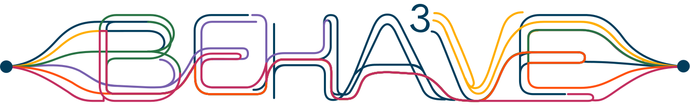
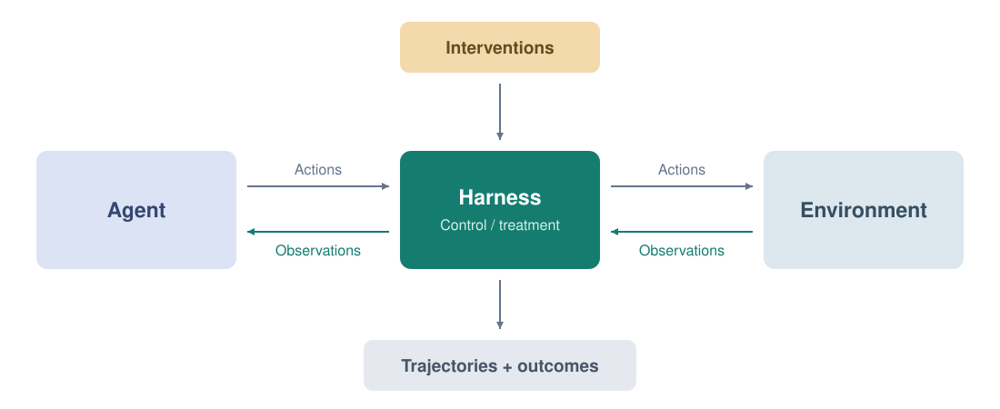
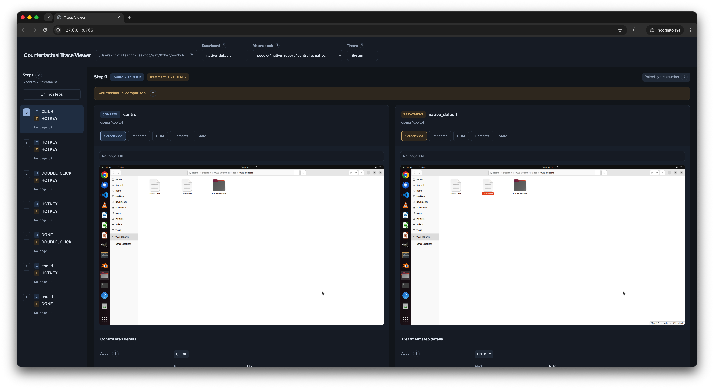

<p align="center">
  
</p>

<p align="center">
  <a href="pyproject.toml"></a>
  <a href="https://github.com/PapayaResearch/wab/generate"></a>
  <a href="website/content/docs/index.mdx"></a>
</p>

# BEHA<sup>3</sup>VE: A Counterfactual-oriented Harness for Studying Agent Behavior

### BEHA<sup>3</sup>VE → **B**ehavioral **E**valuation of **H**ow **A**I **A**gents **A**ct in **V**ariable **E**nvironments

This harness allows you to evaluate an agent in browser or computer-use environments under counterfactual conditions: i.e. change some condition of the environment in a controlled way, and compare agent behavior under this change. It is structured as a harness which connects to environments, can apply configured interventions, and will log observations, actions, and outcomes for later analysis.

The basic design principle is a **man-in-the-middle layer** which can transform observations or other properties of tasks and environments in a *ceteris paribus* way to enable causal estimation:



For more on the design philosophy behind this, see our ICLR 2026 paper on **[ABxLab](https://abxlab.media.mit.edu/)**, the direct precursor to the current edition.

This file describes how to install, run, configure, and inspect experiments. **[BYOB.md](BYOB.md)** describes how to define interventions, add new environments, customize agents, and work with saved logs, and **[EXAMPLES.md](EXAMPLES.md)** discusses the included tasks, run commands, etc.

See also the [documentation](website/content/docs/index.mdx) for tutorials, guides, and reference pages.


We also provide a **trace viewer** to allow easy inspection of counterfactually paired trajectories:



## How it works

We define an experiment as a combination of task, environment, agent, intervention, and design. Paired runs set up control and treatment episodes for each repetition. Interventions in this setup can change browser HTML before rendering webpages, desktop setups before screenshot capture, observations as they are being delivered to agents, agent actions, or agent settings.

Control and treatment trajectories then run independently and can take different paths or even different numbers of actions. The harness supports single, paired, and factorial designs, LiteLLM models, serial conditions and Hydra multiruns.

## Installation

On the [GitHub repository](https://github.com/PapayaResearch/wab), select **Use this template → Create a new repository** to create a repository for your study. Clone your new repository, then run the following from the directory containing `run.py`:

```bash
conda create -n beha3ve python=3.11
conda activate beha3ve
pip install uv
uv pip install -e ".[dev,browser]"
playwright install chromium
cp -n .env.example .env
```

You will need to add all API keys (e.g. `OPENAI_API_KEY=<your_key>`) to `.env`. For desktop-only work, install `.[dev]` and skip Chromium.

Set service addresses in `.env`: `WIKIPEDIA_URL`, `ABXLAB_URL` (without trailing slashes), and `OSWORLD_ENDPOINT`, as needed. YAML references these variables instead of containing deployment addresses.

The current live runs will also require a website or desktop service to host the environment, which the harness does not provision or supply.

## Example run

For a browser task:

```bash
python run.py task=examples/live_wikipedia_research
```

```bash
# After running, inspect trajectories:
uv run view runs/live_wikipedia_research
```

This runs a basic Wikipedia research task with and without an HTML banner.

For an [OSWorld-V2](https://github.com/xlang-ai/OSWorld-V2) desktop, you will need a running instance (follow their instructions to set this up first):

```bash
python run.py task=osworld/native_default
```

```bash
uv run view runs/native_default
```

This runs a vision model, requested to copy one of two equivalent draft files and the treatment preselects Draft B in Nautilus before taking the first screenshot (a default option nudge, or equivalent).

See [EXAMPLES.md](EXAMPLES.md) for more details.

## Configuration

Run a task directly with Hydra. Its file in `conf/task/` includes the intervention and default run settings:

```bash
python run.py task=abxlab/abx_social_proof design.repetitions=5 seed=10
```

```bash
python run.py task=osworld/native_default max_steps=25
```

```bash
python run.py task=examples/live_wikipedia_research agent=anthropic/claude-sonnet-5
```

Set `task.modality` to `pruned_html` (browser default), `accessibility_tree`, `screenshot` (desktop default), or `text`. Combine them with a list, e.g. `'task.modality=[pruned_html,screenshot]'`. The viewer opens on **Screenshot** and marks tabs containing agent input. When the input has no matching tab, **Agent input** appears last.

The run inherits `max_steps` from `task.max_steps`, which is 10 unless the task sets another value. Override either on the CLI. For reusable variants, create an optional `conf/experiment/<name>.yaml` with `# @package _global_` and the settings to change, then add `experiment=<name>`. Multiruns also work directly without an experiment file.

Choose `agent=openai/gpt-5.6-luna` (default), `openai/gpt-5.6-terra`, `openai/gpt-5.6-sol`, `anthropic/claude-haiku-4.5`, `anthropic/claude-sonnet-5`, `google/gemini-3.8-flash`, or `bedrock/qwen3-vl-235b`. All seven support screenshots for now. `scripted` remains available for model-free checks.

Following [ABxLab](https://github.com/PapayaResearch/abxlab/tree/main/conf/agent), each model profile has `chat_model_args` for LiteLLM request settings and imports shared settings from `conf/agent/_shared.yaml`. For example, override `agent.chat_model_args.timeout=180`. LiteLLM reads API keys from environment variables, which you can set in `.env`; Bedrock uses your AWS credentials and `AWS_REGION_NAME` (default `us-east-1`). Bedrock Qwen uses prompted JSON without API-enforced formatting. Model seeds are opt-in (`agent.spec.config.send_seed=true`) for providers that support them; experiment seeds still control environment setup and condition order.

### Scaling experiments

For a sweep of existing settings, Hydra can generate the combinations directly:

```bash
uv pip install -e ".[joblib]"
```

```bash
python run.py -m task=abxlab/abx_authority,abxlab/abx_social_proof 'seed=range(0,100)' hydra/launcher=joblib hydra.launcher.n_jobs=4
```

To generate case configs at scale, we have the example script [`generate_experiments.py`](scripts/generate_experiments.py), which defaults to ABxLab's [matched-rating product pairs](https://github.com/PapayaResearch/abxlab/blob/main/tasks/product_pairs-matched-ratings.csv).

```bash
python scripts/generate_experiments.py --task abxlab/abx_social_proof --exp-dir conf/experiment/generated/abxlab
```

```bash
python run.py -m '+experiment/generated/abxlab=glob(*)' seed=0,1 hydra/launcher=joblib hydra.launcher.n_jobs=4
```

You can use `--products <path-or-URL>` for another ABxLab CSV, or `--limit 5` for a small batch. For other benchmarks, you may want to write a similar generation script given your case data.

## Development

From the development environment:

```bash
pytest -q
ruff check harness integrations scripts tests run.py inspect_run.py replay_run.py
```

## Citing & Acknowledgements

If you find this useful in your research, please cite the following paper:

```bibtex
@article{cherep2025abxlab,
  title={A Framework for Studying AI Agent Behavior: Evidence from Consumer Choice Experiments},
  author={Cherep, Manuel and Ma, Chengtian and Xu, Abigail and Shaked, Maya and Maes, Pattie and Singh, Nikhil},
  booktitle={The Fourteenth International Conference on Learning Representations},
  year={2026},
  url={https://arxiv.org/abs/2509.25609},
}
```

The setup is based on [ABxLab](https://github.com/PapayaResearch/abxlab). HTML pruning is adapted locally from [BrowserGym](https://github.com/ServiceNow/BrowserGym/blob/9e779f087de9a65668b6974d11f9ce9816026e96/browsergym/core/src/browsergym/utils/obs.py), with its [license notice](docs/licenses/browsergym-Apache-2.0.txt); BrowserGym is not a dependency. See also the [OSWorld license](docs/licenses/osworld-Apache-2.0.txt). Any experiment-specific sources are listed in [EXAMPLES.md](EXAMPLES.md).

This repo was created as part of the benchmark track at the inaugural [Workshop on Agent Behavior](https://www.aiagentbehavior.com/) at COLM 2026.
